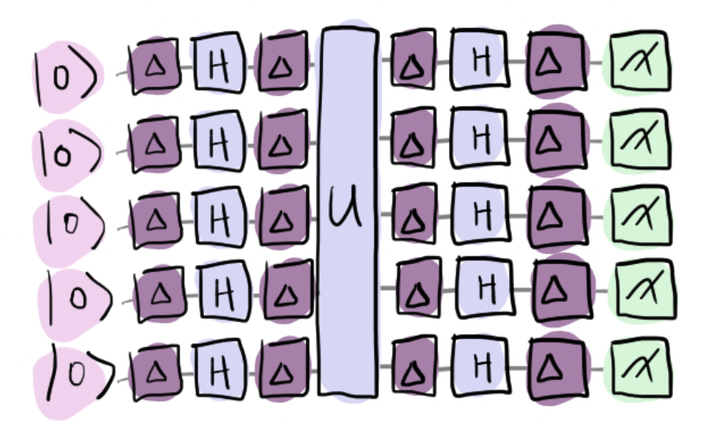

### Backstory

Doc Trine has been kidnapped by a freelance security analyst, Ove, and
held in some sort of 'hyperjail'. Zenda and Reece need to figure out
where it is and how to get there, using only the janky equipment lying
around the office. Once they've rescued her, maybe Doc Trine will finally
reveal the secret of timbits!

At Trine's desk, they find her notebook, full of diagrams,
calculations, and dense, messy handwriting. Leafing through
them, Zenda and Reece discover a note helpfully explaining
what this hyperjail is: "*A 5-dimensional hypercube, accessed from some
unknown point in deep space. Should get those robots out there some
time.*" Robots? They keep reading: "*Cell number is in the magic
5-ball.*" They root around in the games room and find a dusty old magic
5-ball, which outputs 'yes' and 'no' answers to a 5-bit input.
Presumably (though who knows how) Trine has concealed her location in
this oracle. They have another problem, though. The fault-tolerant
office equipment has disappeared along with Trine, leaving only noisy
old circuitry!

### Noisy Bernstein–Vazirani

The oracle encodes the cell number $c \in \\{0, 1\\}^5$, a $5$-bit string.
Consider the dot product

$$
f(x) = x \cdot c = x_0 c_0 + x_1 c_1 + \cdots + x_5 c_5 \mod 2,
$$

where $x \in \\{0, 1\\}^5$ is an arbitrary $5$-bit string. The oracle is
a unitary operator $U_f$ which encodes the dot product $f$
as a phase:

$$
U_f \vert x\rangle = (-1)^{f(x)} \vert x\rangle.
$$

Zenda and Reece need to use this oracle to learn the starting positions
$c$, but equipment in the old lab is noisy, with *depolarizing noise*,
which with some probability $\lambda$ replaces a qubit state with
something random.
Despite the noise, Zenda and Reece can attempt to learn Doc Trine's
coordinates using the *Bernstein–Vazirani algorithm*.
We picture the noisy circuit below:

Your goal: implement a noisy version of the Bernstein–Vazirani
algorithm, using the noisy Hadamard gates provided.
Will it work on the old computer?

## Challenge code

In the code below, you are given various functions:
- `oracle_matrix`: which encodes Doc Trine's location in the hypercube.
- `noisy_Hadamard`: which applies a noisy Hadamard gate, with a
	probability `lmbda` of replacing an incoming or outgoing qubit
	state with something random.
-  `noisy_BernsteinVazirani`: which implements the Bernstein-Vazirani
algorithm using the oracle and the noisy Hadamard operation `noisy_Hadamard`. **You must complete this
function**.

You may find this resource helpful:

- [Bernstein-Vazirani algorithm](https://en.wikipedia.org/wiki/Bernstein%E2%80%93Vazirani_algorithm)

### Inputs

The noisy Bernstein-Vazirani circuit `noisy_BernsteinVazirani` takes as input the
probability  `lmbda (float)` of replacing the state of a qubit.

### Output

Your `noisy_BernsteinVazirani` circuit should correctly output the expectation value
of the Pauli-$Z$ operator on each qubit (`[float]`). The pattern of
positive and negative expectations gives the cell number for any value
of $\lambda$, showing that Bernstein–Vazirani is robust to noise.

If your solution matches the correct one within the given tolerance
specified in `check` (in this case it's a `1e-4` relative error
tolerance), the output will be `"Correct!"` Otherwise, you will
receive a `"Wrong answer"` prompt.
