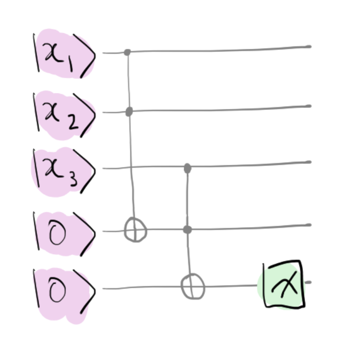

### Backstory

Zenda and Reece have determined Doc Trine's cell number in
 hyperjail.
 Searching through Trine's notebooks, they find another note,
 explaining how the hypercube is patrolled by a fearsome quantum
 warden, which is able to place itself in a superposition and inspect
 multiple cells at once.
To avoid detection and rescue Doc Trine, they need to build a quantum
 radar!

### A quantum radar

The quantum guard can place itself in a superposition

$$
\vert \text{guard}\rangle = \sum_{x} g_x \vert x\rangle,
$$

where $x \in \\{0, 1\\}^5$ ranges over all cell numbers, and $g_x$ are complex-valued amplitudes. Seen in this way, $|g_x|^2$ is the probability that the guard is at position $|x\rangle.$
They know that Doc Trine is located in a cell $c = (1, 1, 0, 0, 1).$
Ideally, they would like to wait until the guard's attention, captured by the probability $|g_c|^2$, is sufficiently low.

In this challenge, we will look for a way to be able to measure $|g_c|^2.$ Unfortunately, there isn't much equipment in the office, and what is there is noisy!
But Trine has left a collection of "Toffoli cascades" lying around, circuits made from a string of noisy Toffoli gates. Here is an example for three input qubits $\vert x_1\rangle \vert x_2\rangle \vert x_3\rangle$:

Measuring the last qubit in the computational basis gives $\vert (x_1 \cdot x_2 \cdot x_3)\rangle$ with probability $1$, where $x_1 \cdot x_2 \cdot x_3$ indicates the *product* of classical bits $x_1$, $x_2$, and $x_3.$
There is a Toffoli cascade acting on $5$ input qubits (and with four auxiliary qubits) that Zenda and Reece can use, as well as some Pauli $X$ gates.
All are subject to *depolarizing noise*, such that after each gate, the state on each qubit is replaced with something random with probability $\lambda.$

Your task: use noisy Toffoli cascades and noisy-Pauli X gates to build
a *quantum radar*, which outputs $\vert g_c\vert^2$, the guard's
attention on Trine's cell.
The guard state will be an input, along with four auxiliary qubits
starting in the $\vert 0 \rangle$ state.

## Challenge code

In the code below, you are given various functions:
- `noisy_PauliX`: which applies the Pauli-X gate and then a layer of depolarizing noise with parameter `lmbda`. (The noise is added for you.)
- `Toffoli_cascade`: a cascade of noisy Toffoli gates (noise parameter
  `lmbda`) which help compute a product, as in the circuit pictured above, with the input qubits on `in_wires` and auxiliary system `aux_wires`. (The noise is added for you.)
- `cascadar`: which takes a `guard_state (numpy.tensor)` and returns $|g_c|^2$,
  using noisy equipment with parameter `lmbda`. **You must complete this function**.

### Inputs

The noisy quantum radar `cascadar` takes as input the guard state
`guard_state (numpy.tensor)`, and a noise parameter `lmbda (float)` controlling the depolarizing noise.

### Output

Your `cascadar` function should gives the correct probability
$|g_c|^2$ for test cases, including the effects of noise.

If your solution matches the correct one within the given tolerance
specified in `check` (in this case it's a `1e-4` relative error
tolerance), the output will be `"Correct!"` Otherwise, you will
receive a `"Wrong answer"` prompt.
