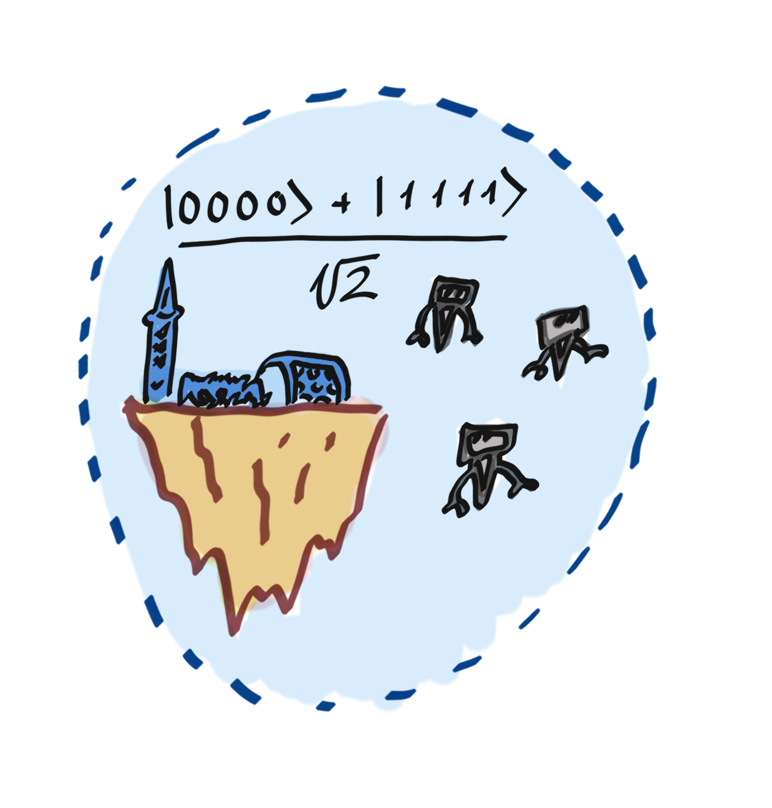
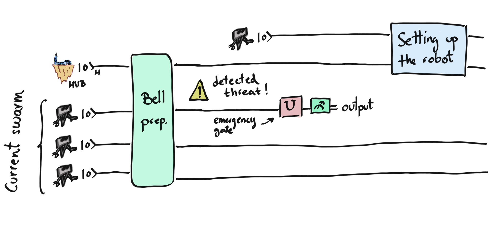

### Backstory

Zenda and Reece have sore fingers from pushing buttons on the mystery
boxes exponentially many times, but they finally have a catalogue of states.
They can return to the fun problem of designing their robot swarm to
explore the galaxy!
The basic idea is that the robots share a state that allows them to move in a
coordinated but random way (to avoid being Ove. A. Heard), and for
individual robots to abort movement if they suspect (from their
quantum radar) that they are being watched.

### Robot swarms and multipartite entanglement

At this point, Zenda and Reece decide to build a swarm of robots to facilitate the search and exploration of space. Not only that, but they decide to use these robots to transport states in a secure way. In this case, they want to transport the "canonical" Bell state

$$
\lvert \Phi \rangle = \frac{|0\rangle_H|000\rangle + |1\rangle_H|111\rangle}{\sqrt{2}}.
$$

The first qubit will remain in the Hub with Reece and Zenda, while the other three qubits will each be transported by a different robot. The problem is that space is not a safe place, and robots can be intercepted. If this happens, the qubit being transported will collapse, altering — due to entanglement — the state of all the other qubits carried by the remaining robots.
For example, if the first robot is intercepted and its qubit collapses to $\vert 1 \rangle$, then all remaining qubits will collapse to $\vert 1 \rangle$ as well, and our Bell state will be destroyed.

For that reason, a security protocol has been designed in which a robot, when it feels threatened, will apply an emergency gate $U$ on its qubit that somehow does not totally destroy the Bell state that we had initially when it is measured. 

After $U$ has been applied, the qubit will collapse and the robot will tell the Hub which state it is observing — 0 or 1. Immediately after sending the message, the robot self-destructs. With the information received from the destroyed robot, Zenda and Reece should be able to send a new robot with a certain state from the Hub such that the initial Bell state $\lvert \Phi \rangle$  is restored and shared between the hub and the existing robots.

The following diagram offers a summary:

We will use five qubits: `hub`, `robot1`, `robot2`, `robot3`, and `auxiliary_robot`. The three robots with the hub — `robot1`, `robot2`, and `robot3` — create the desired Bell state and then take off to begin their journey.
In the diagram above, `robot1` detects a threat, so it applies $U$ and collapses its qubit. Knowing the `output`, the Hub configures the `auxiliary_robot` with a new gate so that now the `hub`, `robot2`, `robot3`, and the `auxiliary_robot` restore the desired state. 

Your goals in this challenge are threefold. First, you will devise the Bell preparation gate that outputs the Bell state $\lvert \Phi \rangle$ between the Hub and the robots. Next, you will decide on a good emergency gate $U$ that allows for the subsequent reconstruction of the Bell state. Finally, you will code the circuit that Zenda and Reece need to build in order to reconstruct the Bell state between the Hub, the new robot, and the surviving robots. 

## Challenge code

In the code below, you are given a few functions:

- `bell_prearation`: creates the state $\frac{1}{\sqrt{2}}(|0000\rangle + |1111\rangle).$ This gate will act on the first 3 robots and the hub — `hub`, `robot1`, `robot2`, and `robot3`. **You must complete this function.**
- `emergency_gate_U`: the gate, $U$, that somehow manages to save the total state after one of the robots is threatened and its qubit collapses. It will act only on one qubit. **You must complete this function.** 
- `setting_new_robot`: takes care of defining a new auxiliary robot configuration. It will only act on the `hub` and `auxiliary_robot` qubits. **You must complete this function.**

### Input

In this challenge, there is no input. Our grader will simply check that the final state of the `hub`, `robot2`, `robot3`, and `auxiliary_robot` qubits is correct.

### Output

This code will output the density matrix (`numpy.tensor`) of the `hub`, `robot2`, `robot3`, and `auxiliary_robot` system. 

If your solution matches the correct one within the given tolerance specified in `check` (in this case, it's a relative tolerance of `1e-5`), the output will be `"Correct!"` Otherwise, you will receive a `"Wrong answer"` prompt.

Good luck!
