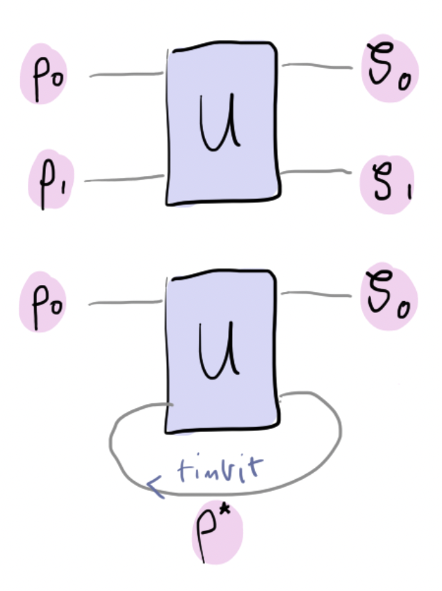

### Backstory

Zenda and Reece have built a robot swarm to search the galaxy.
After diligent — and secure! — searching, the robot swarm has determined
the location of the hypercube portal to be somewhere near the brightest
star in the constellation *Horologium*. Zenda and Reece use their
teleportation protocols to embed their brains into two of the
robots. They break into the hyperjail, avoid the guard with their quantum radar,
and navigate to the cell where Doc Trine is located.

They find her drinking a cup of lapsang souchong and quietly thinking. 

"*You saw my messages! Excellent work. Now, I can finally reveal the secret of
timbits. Timbits are time-travelling qubits. Apparently I put the
messages there in the future! Remind me to do that...
As we will see shortly, timbits are vastly more powerful
than any computational resource we have yet encountered. In fact, I was
arrested by the time police — they had even employed this freelancer Ove to
keep track of me — since they were a bit worried I might mess with
the fabric of spacetime. Bureaucracy, am I right?*" 

Zenda and Reece look at each other with mild
concern, and brace themselves for the next round of adventures.

### Timbits and the NP solver

To understand how timbits work, let's consider a two-qubit gate $U$ with
input states represented by density matrices $\rho_0, \rho_1$ and
output states by $\zeta_0, \zeta_1$, as pictured below.

A timbit, denoted by
$\rho^\*$
in the figure above, is a quantum state that can travel backwards in time and
re-enter the gate.
But, a timbit can't really be any state; it must be controlled by a *consistency condition*, which preserves the timeline so that we can't use it to win the lottery by sending information to the past. More precisely,
given the input states $\rho_0$ and $\rho^*$ for the gate $U$, we must have that the output in the second wire (counting from zero) must be equal to the state that goes in, namely

$$
\rho^* = \text{Tr}_0 [U(\rho_0 \otimes \rho^*) U^\dagger].
$$

Here, $\text{Tr}_{i}$ denotes the partial trace over the $i$-th wire. Therefore, the timbit $\rho^*$ associated with the unitary $U$ is a *fixed point* satisfying $C_U[\rho] = \rho$ for the operator defined by

$$
C_U[\rho] = \text{Tr}_0 [U(\rho_0 \otimes \rho) U^\dagger].
$$

It can be shown that such a fixed point always exists.
In fact, iterating the map $C_U$ a sufficient number of times from any
starting point $\rho$ converges to $\rho^*$!

Now, let's define a new one-qubit quantum channel known as the **timbit gate**. Given a unitary $U$, we define its associated timbit gate $\textsf{T}_U$ via its action on a single input state $\rho_0$:

$$
\textsf{T}_U[\rho_0] = \text{Tr}_1 [U(\rho_0 \otimes \rho^*) U^\dagger].
$$

Here, $\rho^{*}$ is the timbit associated with $U$, as defined above. 

But what can we use timbits for? An interesting application comes from considering the gate 

$$
U_\textsf{NP} = \vert 00\rangle \langle 00\vert + \vert 10 \rangle \langle 01
\vert + \vert 11 \rangle \langle 10\vert + \vert 01\rangle\langle
11\vert
$$

and its associated timbit gate which we denote
$\textsf{T}\_{\textsf{NP}}.$
Although this gate seems innocuous, $\textsf{T}_{\textsf{NP}}$ can be made to solve
[NP-complete](https://en.wikipedia.org/wiki/NP-completeness) problems, such as the [Boolean satisfiability problem](https://en.wikipedia.org/wiki/Boolean_satisfiability_problem) — commonly referred to as the SAT problem. An important step in the SAT problem is finding out whether any elements $x \in \{0, 1\}^n$ satisfy $f(x)=1$, for some Boolean function  $f: \\{0, 1\\}^n \to \\{0, 1\\}.$ 

To get $\textsf{T}_{\textsf{NP}}$ to quickly solve this step of the problem, we first need
need an oracle $U_f$ associated with $f$ with the form

$$
U_f = \sum_{x\in \{0, 1\}^n} \vert x\rangle \langle x \vert \otimes X^{f(x)}.
$$

Even if we can't easily evaluate $f,$ we can efficiently build $U_f,$ so let us assume that we already have it.
We start in the state $\vert 0\rangle^n \otimes \vert 0\rangle$, where
the last qubit will be the input of a timbit gate later. We then carry out each of the following steps:

1. Apply the Hadamard gate to the first $n$ qubits.
2. Apply oracle $U_f,$ which acts on all the qubits.
3. On the last output qubit, apply a timbit gate $\textsf{T}_{\textsf{NP}}$ a total of $q$ times.

After this whole procedure, it turns out that the reduced density matrix for the last qubit has the form

$$
\rho = \frac{1}{2}\left(I+g(q,s)Z\right).
$$

Here, $g(s,q)$ is a function that depends on $q$ and $s$, where $s$ is the number of solutions of $f(x)=1$. It turns out that $g(0,q)=1$ for all $q$. Therefore,

$$
\rho = \frac{1}{2}\left(I+Z\right) \ \textrm{if and only if} \ s = 0.
$$

Conversely, if $s\neq 0$, the function $g(s,q)$ decays exponentially to zero with $q,$ so we quickly converge to

$$
\rho \sim \frac{1}{2}I.
$$

One can show that this allows us to solve this NP-complete problem in polynomial time! Too bad we can't send qubits into the past — yet!

There are two main goals in this challenge. First, you'll create a function that builds and applies a timbit gate. Second, from
a specific choice of gate, you'll build a one-timbit supercomputer to solve the SAT problem! You should be able to do this for any oracle, although we'll choose a particular one to test your function.

### Epilogue

Trine finishes explaining.  "*Of course, using timbits and teleportation I could also send
information to myself in the past and leave the helpful clues that led
you here, without arousing Ove's suspicions.
But all this is theoretical!
Let's go recover the timbits and have some fun.*"

Zenda, Reece and Trine leave the cell and sneak down the
hyperdimensional corridor contraband storage facility, using the quantum radar to make sure the
guard isn't watching. Trine enters the doorcode.
"*There was a note in my cell about where the timbits were stored and
how to get in,*" Trine explains, "*presumably from myself in the
future.*"
They get the timbits out of a storage locker, as well as another magic
8-ball.
"*Let's try this one out, I think it's the travelling salesperson? I always
get them confused.*"
She plugs the timbit into the 8-ball and starts running the
computation.
There is a puff of purple smoke, and the world goes dark.

After a while, Zenda says: "*Are we out?"
They hear a reply from the void: 
"*More like OWT. You've just experienced an Oracle
World Transform. It's like a timbit, but even more powerful. It finds
a unitary which, when run with a timbit, produces a desired output
state. The absent-minded Trine just ran an OWT which not only erases
her existence, but embodies me in a cosmic distributed quantum
computer, Sqynet. Enjoy the new galactic regime!*"

Zenda and Reece will have to put in their best effort to defeat Sqynet
and save the galaxy by themselves!

<i>Read on in <b>Fall of Sqynet</b>.</i>

## Challenge code

In the code below, you are given a few functions:

- `calculate_timbit`: This function will return a timbit associated to the operator $U$ and input state $\rho_0$, given an initial guess  $\rho$ for the timbit. It returns the density matrix representation of the timbit $\rho^{*}.$ **You must complete this function**.
- `apply_timbit_gate`:  Returns the output density matrix after applying a timbit gate to a state $\rho_0$.
    The input and output density matrices are associated with the first qubit.
- `SAT`: uses a timbit gate to solve the
  satisfiability problem for an arbitrary Boolean function $f$ (on
  `n_bits` bits) with an oracle in matrix form `U_f`, using `q` timbit gates, and `rho` being the initial guess for the NP fixed point. The output should be the computational basis measurement probabilities for the last qubit, which should be `[1. , 0.]` if and only if there are no elements $x$ such that $f(x) =1.$ **You must complete this function**.

### Inputs

As input to this problem, you are given:

- `q (int)`: the number of times the timbit gate is applied to solve the SAT problem.

Additionally, you are given the following global variables:

- `U_f array(array(float))`:  the oracle $U_f$ we will use to test your solution in matrix form.
- `U_NP array(array(float))`: the gate $U_{\textsf{NP}}$ as defined above.
- `rho (array(array(float))`: the initial guess for the stationary state of the timbit gate $\textsf{T}_{\textsf{NP}}.$

### Output

The output for this challenge corresponds to the output of your `SAT` function. It should produce a `numpy.tensor` of length 2 corresponding to the measurement probabilities in the computational basis for the qubit on which the timbit gates are applied.
