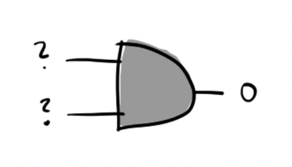
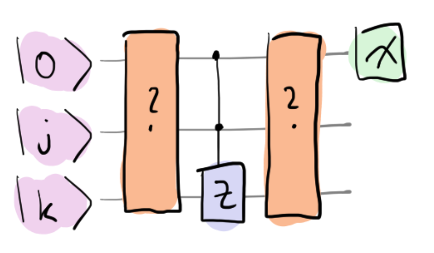

### Backstory

Zenda and Reece work at Trine's Designs, a startup run by the
eccentric inventor Doc Trine.
Trine promises to tell Zenda and Reece about a
revolutionary new type of quantum resource she has invented called "*timbits*".
Before explaining timbits, she insists on demonstrating [Bennett's
Laws of Infodynamics](https://en.wikipedia.org/wiki/Bennett%27s_laws),
governing the behaviour of quantum information.
"*Only then*," she says, "*will the power of
timbits be revealed in their full glory*."

### Reversible computation

Some classical logical operations are *irreversible*. For instance,

$$
\text{AND}(0, 0)= \text{AND}(0, 1)= \text{AND}(1, 0)= 0,
$$

so given that $\text{AND}(j, k) = 0$, we can't tell the values of $j$ and $k.$

Put differently, there is no way to press `ctrl-Z` and learn what went in! In contrast, quantum circuits are built out of unitary gates, which are always reversible. We can always press `ctrl-Z`! How can we encode something irreversible, like an AND gate, into a quantum circuit? Aptly, the answer is a controlled $Z$ gate! It encodes the classical operation into a *phase*:

$$
CZ \vert j, k\rangle \mapsto (-1)^{\text{AND}(j, k)}\vert j, k\rangle.
$$

A phase by itself is unobservable, so we need to interfere this state with some others to detect it. A simple way to do this is to use a *controlled* controlled $Z$ gate, with some extra operations on either side:

Your job: figure out which operations to apply so that measurement on
the first qubit is guaranteed to be in state
$\vert \text{AND}(j, k)\rangle$.

### Laws of Infodynamics: The First Law (optional)

This box contains some interesting but nonessential details.
A qubit can be used to imitate a classical bit (which we'll call
*cbits*), since instead of sending a cbit $j$, we can send a basis
state $\vert j\rangle.$ We can write this as an inequality, the First
Law of Infodynamics:

$$
1 \text{ qubit} \geq 1 \text{ cbit}. \tag{1}
$$

But although we can encode classical data into qubits, it's not
obvious we can always compute in the same way.

## Challenge code

In the code below, you are given a function called `AND(j, k)`. **You
must complete this circuit** and provide gates which implement a
classical AND gate.
More precisely, if the second and third qubits are in states $\vert
j\rangle$ and $\vert k\rangle$, the circuit should place the first
qubit in state $\vert\text{AND}(j, k)\rangle.$

### Inputs

As input to this problem, you are given two bits `j (int)` and `k
(int)`, encoded onto the second and third qubits for you.

### Output

Your circuit must place the first qubit in basis state `AND(j,
k)`. This will be checked using `qml.probs(wires = 0)`, which gives
`[1, 0]` for $\vert 0\rangle$ and `[0, 1]` for $\vert 1\rangle.$

If your solution matches the correct one within the given tolerance
specified in `check` (in this case it's a `1e-4` relative error
tolerance), the output will be `"Correct!"` Otherwise, you will
receive a `"Wrong answer"` prompt.
