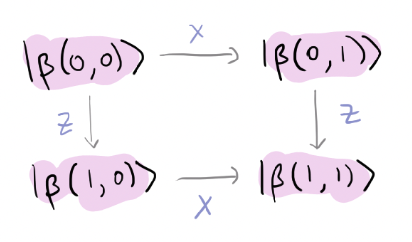

### Backstory

Zenda and Reece have worked hard to implement classical computation
reversibly.
"*This is all rather boring though,*" says Trine. "*Let's introduce
entanglement and have some fun!*"
Trine tells them that the next [Laws of
Infodynamics](https://en.wikipedia.org/wiki/Bennett%27s_laws) will
constrain how much classical information can be sent using entangled quantum
resources.

### Sending information with entangled states

Entanglement is a valuable resource that can be used to send
information, as we will explore in this challenge.
Superdense coding, for instance, uses Bell pairs to send two classical
bits with a single qubit.

Trine has misplaced her usual Bell states, and instead provides Zenda with 2 qubits and Reece with 1 qubit. They are entangled forming the following state: 

$$
\vert \Psi \rangle = \frac{|00\rangle_Z|0\rangle_R + |11\rangle_Z|1\rangle_R}{\sqrt{2}}.
$$

Zenda wants to send Reece 3 bits of information $(i,j,k),$ where each bit can take the value 0 or 1. To do so, she will apply an **encoding gate** on her two qubits and then send them to Bob.

Reece, who now has the three qubits and knows the strategy Zenda uses to encode, performs a decoding gate that will generate the state $|i,j,k\rangle.$
Let's look at the following drawing to understand it.

Your goal will be to devise a coding and decoding strategy such that Reece can decode Zenda's bits, as shown in the figure above.

The strategy to build the encoding gate is akin to [superdense coding](https://en.wikipedia.org/wiki/Superdense_coding) for two bits of information, where all the Bell basis states are produced by acting only on one of the qubits in an entangled pair. Here, we want to produce all the GHZ basis states, which are analogous to the Bell basis for three qubits. They are given by 

$$
\lvert \text{GHZ} \rangle_{ijk} = \frac{1}{\sqrt{2}}\left(\vert 0 j k\rangle +(-1)^i\vert 1 \bar{j} \bar{k}\rangle\right),
$$

where $\bar{j}= 1-j$ and $\bar{k}= 1-k$. However, we should do this by acting only on the first two qubits (i.e. Zenda's share) of the entangled state $\vert\Psi\rangle$ that Trine provided. The decoding gate is also inspired by superdense coding, so reviewing the topic will help you a lot in this challenge!

### Laws of Infodynamics: The Second and Third Laws (optional)

This box contains information that may be helpful, but is not
essential to solving the problem.
Suppose Zenda and Reece share a maximally entangled Bell pair of the
form

$$
\vert \Phi\rangle_{ZR} = \frac{\vert 0\rangle_Z \vert
0\rangle_R + \vert 1\rangle_Z \vert 1\rangle_R}{\sqrt{2}},
$$

where the subscripts $Z$ and $R$ denote Zenda and Reece's share, respectively.
This is one of four maximally entangled *Bell states*, labelled by two
bits $j$ and $k$:

$$
\vert\beta(j, k)\rangle_{ZR} = \frac{1}{\sqrt{2}}(\vert 0\rangle_Z
\vert k\rangle_BR+ (-1)^j \vert 1\rangle_Z \vert k \oplus
1\rangle_R),
$$

with $\vert\Phi\rangle_{ZR} = \vert\beta(0,0)\rangle_{ZR}.$
These are orthogonal and form what is called the *Bell basis* for the
states on two qubits.

Half of an entangled state is called an entangled qubit or *ebit*.
Since the ability to send an entangled qubit is a special case of
sending a qubit, we have the Second Law of Infodynamics:

$$
1 \text{ qubit} \geq 1 \text{ ebit}, \tag{2}
$$

where $x \geq y$ means having resource $x$ also provides resource $y.$
It's easy to check that

$$
\vert \beta(j, k)\rangle = (Z^jX^k \otimes I )\vert \Phi\rangle.
$$

We draw this below:

If Zenda and Reece share $\vert\Phi\rangle$ (an ebit), and Zenda sends her
qubit to Reece, Reece can measure in the Bell
basis and learn $j$ and $k.$ Thus, an ebit and a qubit suffice to
send two classical bits (or *cbits*).
This protocol, called *superdense coding*, can be expressed as
the Third Law of Infodynamics:

$$
1 \text{ qubit} + 1 \text{ ebit} \geq 2 \text{ cbits}. \tag{3}
$$

## Challenge code

You simply have to complete two quantum functions:

- `encode`: quantum function that will define an operator to be applied only on Zenda's qubits. This function will depend on the bits $(i,j,k)$ to be encoded.

- `decode`: quantum function that defines the operator that Reece will use to retrieve the bits that Zenda sent. In this case, the operator does not have any information about Zenda's bits, so the same operators will always be applied regardless of the state that Zenda sends Reece.

### Output

In this challenge, we will not judge your solution using public or private test cases. Instead, we will check that, for all combinations of $i$, $j$, and $k$, the entire encoding and decoding circuit behaves as expected.

