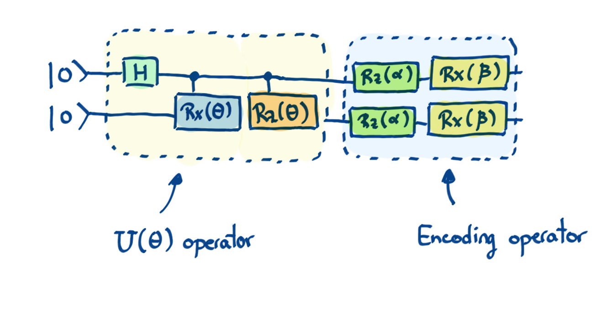

### Backstory

Now Zenda and Reece have a cute way to send each other private
messages using entangled qubits.
Trine applauds them. "*Good work! But now that I think of it,
superdense coding can be reversed, in a manner of speaking, to send
quantum information using entanglement and classical bits. This will
not only bring us to the last [Law of
Infodynamics](https://en.wikipedia.org/wiki/Bennett%27s_laws), but
teach us some basic facts about spacetime! Certain things have to be
hidden from Nature itself.*" Zenda and Reece look perplexed. Trine
smiles: "*Wait until I show you what timbits can do!*"

### From causality to encryption

Zenda needs to send quantum states to Reece over a channel where
someone could intercept the messages. They decide to encode the states
they want to send with rotations on all of the qubits. To do this, they
have chosen two real numbers, $\alpha$ and $\beta$, in advance, so
that the states can be encoded as follows:

In this case, $U(\theta)$ is defined as the gate that generates the state $|{\psi}\rangle$ — what Zenda wants to send to Reece — that depends on a real number $\theta.$
Thus, if someone intercepts the message, instead of getting state $|\psi\rangle$ they will get state $(R_X(\beta)R_Z(\alpha))^{\otimes 2}|\psi\rangle.$

Although it seems like a super secure encoding procedure, it is not perfect! Once $\alpha$ and $\beta$ have been chosen, there are certain values of $\theta$ that could make $(R_X(\beta)R_Z(\alpha))^{\otimes 2}|\psi\rangle = |\psi\rangle$ for certain states. This is a big problem — it means that someone is going to intercept the hidden state! 

We will say that $\alpha$ and $\beta$ are $\epsilon$-unsafe values if there exists a $\theta$ such that

$$
|\langle 0|U^{\dagger}(\theta)(R_X(\beta)R_Z(\alpha))^{\otimes 2}U(\theta)|0\rangle|^2 \ge 1 - \epsilon.
$$

Your goal is to determine if $\alpha$ and $\beta$ are unsafe values given $\epsilon.$

### Laws of Infodynamics: The Fourth Law (optional)

This box contains information that is not essential to solving the problem.
Superdense coding sends two classical bits (cbits) via a qubit
and half of an entangled Bell pair (ebit).
Teleportation is a converse protocol, sending a qubit with two cbits
and an ebit.
Suppose Zenda has a state $\vert\psi\rangle_{Z'}$ she wants to send to Reece,
and they share a Bell state $\vert\beta(0,0)\rangle_{ZR}$, where

$$
\vert\beta(j, k)\rangle_{ZR} = \frac{1}{\sqrt{2}}(\vert 0\rangle_Z
\vert k\rangle_R + (-1)^j \vert 1\rangle_Z \vert k \oplus
1\rangle_R).
$$

We use the notation $\vert\Phi\rangle = \vert \beta(0,0)\rangle$ for
the "canonical" Bell pair.
Here, $Z'$ denotes Zenda's qubit where the state for teleportation is
initially stored, and $Z$ the qubit which is initially entangled with Reece.
Some algebra shows that the state of the whole system is

$$
\vert \psi\rangle_{Z'} \vert \Phi\rangle_{ZR} = \frac{1}{2}\sum_{jk} \vert
\beta(j, k)\rangle_{Z'Z} X^kZ^j \vert\psi\rangle_R.
$$

Note that in the operators $X^j Z^j$, $k$ comes *before* $j.$ 
If Zenda performs a Bell measurement (i.e. measure in the basis
$\{\vert\beta(j,k)\rangle\}$) on her system, she will learn two
bits $j$ and $k$, and Reece will have Zenda's state in the disguised
form $X^kZ^j \vert\psi\rangle.$
For instance, if Zenda measures $j = k = 0$, we apply the projector

$$
P = \vert\beta(0,0)\rangle\langle \beta(0,0) \vert_{Z'Z},
$$

normalize, and obtain a post-measurement state

$$
\vert\beta(0, 0)\rangle_{Z'Z}\vert\psi\rangle_R.
$$

After she measures the cbits $j$ and $k$, Zenda can send them to
Reece, who takes off the disguise $X^k Z^j$ to find
$\vert\psi\rangle.$
Since an ebit and two classical bits suffice to
teleport a qubit in an arbitrary state, we have the Fourth Law of
Infodynamics:

$$
1 \text{ ebit} + 2 \text{ cbits} \geq 1 \text{ qubit} \tag{4}
$$

where $x \geq y$ means having resource $x$ also provides resource $y.$
The disguising operators $X^kZ^j$ seem like a nuisance, but turn out
to be essential to maintaining the fabric of spacetime!
Since entanglement acts in a spooky, instantaneous way at a distance,
if Zenda could magically teleport $\vert\psi\rangle_{Z'}$ to Reece without
the disguise, she could send information faster than light.
If Reece knows nothing about $j$ and $k$, it turns out that the state
is perfectly disguised, in the sense that

$$
\rho_R = \frac{1}{4}\sum_{jk} X^k Z^j \vert\psi\rangle\langle\psi\vert
(X^k Z^j)^\dagger = \frac{1}{2}\mathbb{I}.
$$

This inspired Zenda and Reece to play around with $X$ and $Z$
rotations as a way of concealing information.

## Challenge code

In the code below, you are given a function called `is_unsafe`. **You must complete this function** by coming up with a way — you are given total freedom, from making a variational circuit to finding an analytical solution — to determine if the given values of $\alpha$ and $\beta$ values are $\epsilon$-unsafe.

### Inputs

As input to this problem, you are given a `list(float)` containing the values of $\alpha$, $\beta$, and $\epsilon$, in that order.

### Output

This code must output a boolean — `True` or `False` — corresponding to whether the values of $\alpha$ and $\beta$ are $\epsilon$-unsafe.
For example, if you determine that the given values of $\alpha$ and $\beta$ *aren't* $\epsilon$-unsafe, your code must output `False`. 

If your solution is correct, the output will be `"Correct!"` Otherwise, you will receive a `"Wrong answer"` prompt.

Good luck!
