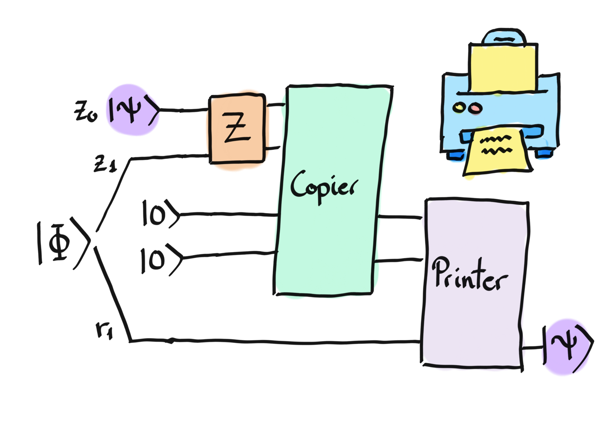

### Backstory

Trine is getting bored. "*So, we've finished the usual [Laws of
Infodynamics](https://en.wikipedia.org/wiki/Bennett%27s_laws). Let's
make things more interesting!*" She shows Zenda and Reece to the
office photocopier. "*I figured out a way to turn *this* into a quantum
resource! Pretty cool huh?*" Zenda and Reece look at each other, puzzled as
ever by Trine's unconventional ideas about office equipment. Trine
pats the photocopier.
"*Yup, this old thang can photocopy a basis state. You can use it to make
Bell pairs! In fact, we can introduce the photocopier into our
superdense and teleportation protocols in such a way that it turns
infodynamic inequalities into equalities. We'll find that a
photocopier is halfway between a qubit and an entangled bit! I always said this
was a halfway-decent photocopier.*" Zenda and Reece
shrug and start feeding qubits into the machine.

### Coherent protocols

Zenda and Reece are having a bit too much fun feeding qubits into the photocopy machine.
It's not very good at photocopying qubits, but it can copy basis states into new registers
in the following way

$$
\vert j\rangle \mapsto \vert j\rangle \vert j\rangle,
$$

and extending linearly to the whole space. From linearity, you can prove yourself that the operator the photocopy machine is applying does not allow for copying arbitrary states! 

Zenda ponders the meaning of Trine's words. She wonders if she can use the photocopy machine as a quantum fax machine instead. *That should be equivalent to quantum teleportation... except that I wouldn't need to do mid-circuit measurements.* She convinces Reece to join on the mischief, sharing with him half of the Bell state

$$
\lvert \Phi \rangle = \frac{1}{\sqrt{2}}\left( \vert 0\rangle_{Z_1} \vert 0\rangle_{R_1} + \vert 1\rangle_{Z_1} \vert 1\rangle_{R_1}\right).
$$

Let's see how Zenda and Reece get away with this. Zenda has a state $\vert \psi \rangle$ that she wants to transfer to Reece, and half of the Bell pair above. After doing some operations $Z$ on her two qubits, she can perform the `copier` operation that copies basis states into two registers inside the copy machine's server. That information is then transfered to Reece's printer where, after performing the `print` operation with his states, he prints the state $\vert\psi\rangle$ into his half of the entangled pair. 

Zenda shows Reece the schematics for the above:

Your task is to build the operator $Z$ that Zenda must perform on her qubit, as well as the copier and printer operators needed to teleport the state. For the copier operator, the simplest way is to use the basis copying operator introduced at the beginning:

$$
\vert j\rangle \vert 0 \rangle \mapsto \vert j\rangle \vert j\rangle,
$$

 Which well-known gate achieves this?

### Laws of Infodyamics: Coherent versions (optional)

This box contains some interesting but nonessential details.

The operation
$$
\vert j\rangle \vert 0 \rangle \mapsto \vert j\rangle \vert j\rangle,
$$
we introduced in this challenge is knows as a **cobit**.

As a simple application of cobits, we can make a Bell pair by applying the
photocopier to the $\vert +\rangle$ state:

$$
\frac{1}{\sqrt{2}}(\vert 0\rangle + \vert 1\rangle) \mapsto
\frac{1}{\sqrt{2}}(\vert 00\rangle + \vert 11\rangle).
$$

But cobits are much more interesting!
As a first example, one can modify superdense coding so that
Zenda and Reece can copy two
bits:

$$
\vert j, k\rangle_Z \mapsto \vert j, k\rangle_Z \vert j, k\rangle_R.
$$

The basic idea is to replace the act of sending two classical bits, $j$
and $k$, with the act of copying two basis states:

$$
\vert j, k\rangle_Z \mapsto \vert j, k\rangle_Z \vert j, k\rangle_R.
$$

We can rewrite the Third Law of Infodynamics (superdense coding) in
terms of cobits as

$$
1 \text{ qubit} + 1 \text{ ebit} \geq 2 \text{ cobits}, \tag{3'}
$$

where $x \geq y$ means having resource $x$ also provide resource $y$,
and "ebit" means "entangled bit", i.e. half a Bell pair.
Similarly, it is possible to perform teleportation *coherently*, so
that sending random bits $j, k$ to correct the teleported state is
instead a unitary involving $\vert j, k\rangle.$ This leads to a new
version of the Fourth Law of Infodynamics (teleportation):

$$
1 \text{ ebit} + 2 \text{ cobits} \geq 1 \text{ qubit} + 2 \text{
ebits} \tag{4'}.
$$

If we subtract an ebit from both sides and combine with the modified
Third Law, we obtain the *equality*

$$
2 \text{ cobits} = 1 \text{ qubit} + 1 \text{ ebit}.
$$

Photocopying basis states is precisely halfway between an ebit and a
qubit!

## Challenge code

In this challenge, you will be asked to complete the `zenda_operator`, `copier`and `printer` functions. All of them are quantum functions where you will only have to place the necessary gates.

### Inputs

The inputs of this challenge correspond to the three coefficients of a $U3$ gate in charge of encoding the state $|\Phi\rangle$ that Zenda wants to send.

### Outputs
To check the solution, we will calculate the expected value with respect to a particular observable to see that it coincides with the same one generated by Zenda.
If your solution matches the correct one within the given tolerance
specified in `check` (in this case it's a `1e-2` absolute error
tolerance), the output will be `"Correct!"` Otherwise, you will
receive a `"Wrong answer"` prompt.
