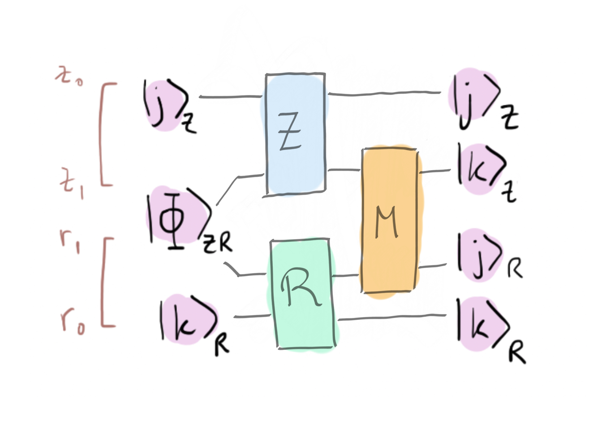
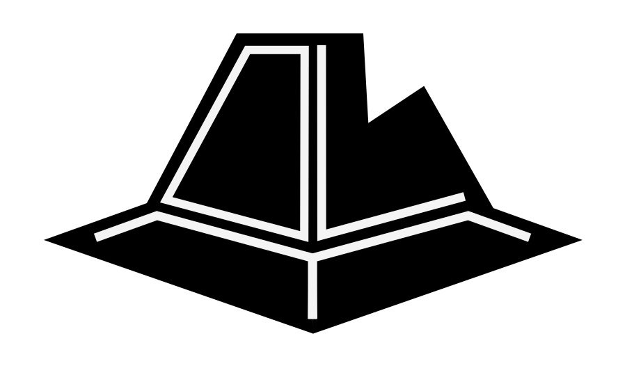

### Backstory

Zenda and Reece have been busy photocopying qubits and making
their old communication protocols coherent. Zenda asks Trine what this
has to do with timbits. Trine replies: "*Timbits? I forgot all about
them. I suppose I wanted to show you there is more in heaven and earth
than qubits and entangled pairs!*" Reece objects: "*But why did you get us to do
all those protocols with photocopiers?*" Trine looks confused for a
moment, then a smile spreads over her face. "*That's right! We can use
them to implement a SWAP gate using two CNOTs as opposed to the usual
three. Let's do that as a warm-up for timbits!*"

### Exchanging qubits

Did you know that there is no way for us to clone a quantum state? The no-cloning theorem states that there is no gate $U$ such that

$$ 
U\lvert \psi \rangle \lvert 0 \rangle = \lvert \psi \rangle \lvert \psi \rangle  
$$

for all states $\lvert \psi \rangle$. However, if we only work with basis states $\lvert j \rangle$, there exist operations such that 

$$ 
\lvert j \rangle \lvert 0 \rangle \mapsto \lvert j \rangle \lvert j \rangle.
$$

Zenda and Reece are each in possession of one basis state, which we denote $\lvert j\rangle_{Z_0} $ and $\lvert k \rangle_{R_0}$ respectively. Trine tells them to send each other their basis state to each other without losing their own. *"If basis states can be cloned, then surely we can do this"*, claims Zenda confidently. *"Just give us two qubits in the $\lvert 0 \rangle$ state to each of us and we're good to go."*

Trine thinks about this... *"It's too easy if I allow you to do whatever you want"*—she concludes. *"Let's make it more fun. I'll give you each one qubit from a Bell state* 

$$
\vert \Phi\rangle_{Z_1R_1} = \frac{1}{\sqrt{2}}\left(\vert 0\rangle_{Z_1} \vert 0\rangle_{R_1} + \vert 1\rangle_{Z_1} \vert 1\rangle_{R_1}\right) .
$$

*"Then you'll have to send your qubit to each other by acting only on the qubits in your possession.*"

Zenda and Reece try and try, but it seems like a futile task. *"We need more resources*—mumbles Reece. *"Mmm... disappointing"* says Trine. *"Then, I'll allow you to use a *magic gate* between your initially entangled qubits, but figure it out fast!"* 

In this challenge, you will help Zenda and Reece figure out a quantum circuit that performs the operation

$$
 \lvert j \rangle_{Z_0} \lvert{\Phi}\rangle_{Z_1R_1} \lvert k \rangle_{R_0} \mapsto \lvert j \rangle_{Z_0} \lvert k \rangle_{Z_1} \lvert j \rangle_{R_1} \lvert k \rangle_{R_0}
 $$

with the constraints imposed by Trine. This means that the circuit must be of the form shown in the image below.

 

In the above, $Z$ is the operator Zenda applies on her qubits, $R$ is the operator Reece applies on his qubits, and $M$ is the magic operator provided by Trine. This operation is one of the building blocks you need to master to build a SWAP gate with only two CNOTs, without counting the distributed CNOTs (contained in the magic gate). See the optional reading below for more about this!

### Laws of Infodynamics: Cheap swaps (optional)

This box contains some interesting but nonessential details.
As with previous Laws of Infodynamics, we can write the ability to perform one task in terms of
others as an inequality:

$$
1 \text{ CNOT} + 1 \text{ ebit} \geq 1 \text{ cobit}_{Z \to R} + 1
\text{ cobit}_{R \to Z}, \tag{$\geq$}
$$

where the subscripts denote the source and target of copying.
Similarly, it's possible to simulate a distributed
CNOT gate from Zenda (control) to Reece (target) using a shared ebit
and cobit exchange.
This leads to an inequality

$$
1 \text{ CNOT}_{Z\to R} + 1 \text{ ebit} \leq 1 \text{ cobit}_{Z \to R} + 1 \text{ cobit}_{R \to Z}. \tag{$\leq$}
$$ 

We can combine the inequalities $(\leq)$ and $(\geq)$ into an
*equality* for cobit swapping:

$$
1 \text{ CNOT}_{Z\to R} + 1 \text{ ebit} = 1 \text{ cobit}_{Z\to R} + 1
\text{ cobit}_{R \to Z}. \tag{=}
$$

This means that the resources on either side are equivalent!
But this isn't just theoretical; it leads to a neat computational insight. We know that three zigzag CNOTs are equivalent to a swap gate:

$$
\text{SWAP}_{Z \leftrightarrow R} = \text{CNOT}_{Z \to R} \cdot
\text{CNOT}_{R \to Z} \cdot \text{CNOT}_{Z \to R}.
$$

We previously learnt that a cobit is the average of a qubit and an ebit:

$$
2 \text{ cobit}_{Z \to R} = 1 \text{ qubit}_{Z \to R} + 1 \text{ ebit}_{Z \to R}.
$$

If we double the equation $(=)$ and use this average property, we find that

$$
2 \text{ CNOTs} + 2 \text{ ebits} = 1 \text{ qubit}_{A \to B} + 1
\text{ qubit}_{B \to A} + 2 \text{ ebits}.
$$

Subtracting two ebits from each side, the LHS is two distributed CNOTs (one from Reece to Zenda and vice-versa) and the RHS is a qubit sent in either direction.
This is fancy terminology for a SWAP gate!
Thus, we learn that only *two* CNOTs are needed to perform a SWAP:

$$
2 \text{ CNOTs} = 1 \text{ SWAP}.
$$

Pretty nifty huh! Note that we've subtracted four ebits in total from
both sides, so we don't count the four CNOTs used to prepare these.

### Epilogue

Trine looks pleased. "*But all of this is merely an amusing
diversion. Let's finally talk about timbits...*"
At this very moment, Doc Trine, and the equipment she has been using to
demonstrate the Laws of Infodynamics, disappear in a puff of sparkling
purple smoke.
Instead of lab equipment, there is only a business card, reading:

 

<i>Ove A. Heard: Freelance Data Security Analyst</i> 
'We're Always Watching'

 

On the reverse, an elegant handwritten note: 

Trine and the timbits are in hyperjail.  
— Ove A. and OWT.

 

How can they rescue Doc Trine? 
Where is this hyperjail?
And when will they learn the secret of timbits?!

<i>Read on in <b>A Tale of Timbits</b>.</i>

## Challenge code

In the code below, you are given a number of functions:
- `zenda_operator`: Quantum function corresponding to the operator to be applied by Zenda on her qubits. **You must complete this function.**
- `reece_operator`: Quantum function corresponding to the operator to be applied by Reece on his qubits. **You must complete this function.**
- `magic_operator`: The magic operator provided by Trine to be applied on the initially entangled qubits $Z_1$ and $R_1$. **You must complete this function.**

### Inputs and outputs

There are no inputs nor outputs for this challenge. You answer will be judged based on the fact that your circuit produces the correct final state for any combination of basis states $\lvert j \rangle_{Z_0}$ and $\lvert k \rangle_{R_0}$. This will be verified in the `check` function. 

