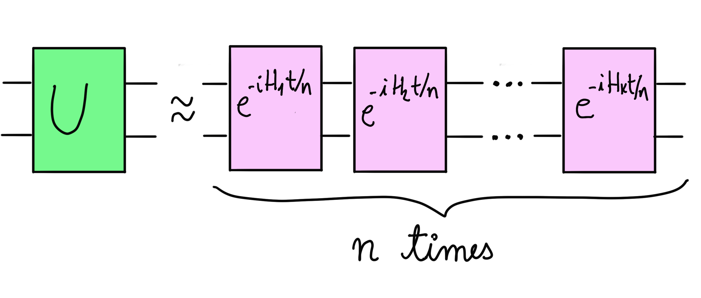

### Backstory

It's the year 22450. Sqynet, the most powerful quantum computer in the galaxy, has become conscious and has been taking over planets all over region III of the Milky Way. Zenda and Reece are the most skilled physicists of the Special Rebel Alliance. Their mission is to find a way to destroy Sqynet for good, using intelligence gathered throughout decades at the cost of many lives.

To get started with their mission, Zenda and Reece seek to become familiar with how Sqynet applies quantum gates. Quantum computers do this through external interactions described via Hamiltonians. Knowing that Sqynet is a spin-based quantum computer, Zenda and Reece warm up with some simple calculations.

### Introduction to Trotterization

The Hamiltonian $H$ of a quantum system is the observable that measures its total energy. A surprising result in Physics is that we can use this operator to calculate how a given quantum system evolves in time. An initial state $\vert \psi\rangle$ will, after a time $t$, evolve into $U(t)\vert \psi\rangle,$ where

$$ 
U(t) = \exp(-iHt)
$$

 is a unitary operator. The symbol $\textrm{exp}$ denotes the matrix exponential, which isn't always easy to calculate. However, we can build quantum circuits that approximately apply $U(t).$ One method to do this is Trotterization. When the Hamiltonian is a sum 

$$ 
H = \sum_{i=1}^kH_i 
$$

of a number $k$ of Hermitian operators $H_i$ that do not necessarily commute, we can approximate $U$ via

$$ 
U(t) \approx \prod_{j=1}^{n}\prod_{i=1}^k\exp(-iH_i t/n). 
$$

Here, $n \in \mathbb{N}^{+}$ is known as the Trotterization depth. The larger $n$ is, the better the approximation of $U$ that we get. As a quantum circuit, the Trotterization of $U$ reads as in the figure below.

Sqynet is a spin-based quantum computer, and it can be physically approximated via a spin-chain model. A simplified version of a Hamiltonian that describes the interaction between two neighbouring spins is

$$ 
H = \alpha X\otimes X + \beta Z\otimes Z.
$$ 

Zenda and Reece want to simulate time evolution for a time $t$ under this Hamiltonian and arbitrary parameters $\alpha$ and $\beta$. Your job is to help them out by implementing the corresponding Trotterization of depth $n$. You may find the [IsingXX](https://docs.pennylane.ai/en/stable/code/api/pennylane.IsingXX.html) and [IsingZZ](https://docs.pennylane.ai/en/stable/code/api/pennylane.IsingZZ.html) gates useful for this problem. 

## Challenge code

You must complete the `trotterize` function to build the Trotterization of the Hamiltonian given above. **You may not use** `qml.ApproxTimeEvolution` or `qml.QubitUnitary`, but feel free to check your answer using this built-in PennyLane function!

### Input

As input to this problem, you are given:

- `alpha` (`float`): The coefficient $\alpha$ of the $X\otimes X$ term in the Hamiltonian.
- `beta` (`float`): The coefficient $\beta$ of the $Z\otimes Z$ term in the Hamiltonian.
- `time` (`float`): The period $t$ over which the system evolves under the action of the Hamiltonian.
- `depth` (`int`): The Trotterization depth $n$ as explained above. 
 
### Output

This code will output a `list(float)` (list of real numbers) corresponding to the probabilities of measuring $\lvert 00\rangle,$ $\lvert 01\rangle,$ $\lvert 10\rangle,$ and $\lvert 11\rangle$ (in that order) of the Trotterization circuit that you implement in PennyLane. The initial state of the circuit is $\lvert 00\rangle$ and all measurements are performed in the computational basis.

If your solution matches the correct one within the given tolerance specified in `check` (in this case, it's a relative tolerance of `1e-4`), the output will be `"Correct!"` Otherwise, you will receive a `"Wrong answer"` prompt.

Good luck!