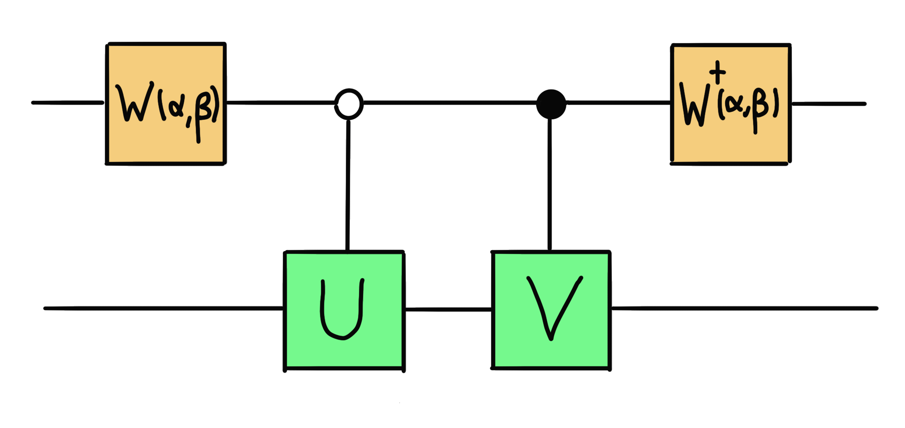

### Backstory

Zenda and Reece try to figure out Sqynet's Hamiltonian, before this eerie conscious quantum computer conquers the entirety of sector III. For this, they need to use their own (non-sentient) quantum computer to simulate the action of a Hamiltonian on a quantum state. How do they do this, if a Hamiltonian is, in general, not a unitary?

### Linear combination of unitaries

Zenda and Reece know that the Hamiltonian that describes Sqynet is a linear combination of unitaries, that is

$$ 
H = \sum_{i}\alpha_i U_i.
$$

We know that quantum circuits can implement unitary operations really easily, but is there a way to implement a sum of unitaries? Note that the sum of unitaries is not always a unitary, so how can we even do this? We can use measurements! 

A circuit of the form

<p align="center">

</p>


will probabilistically implement the combination of unitaries $\alpha U +\beta V$ on the bottom (main) register, where $\alpha$ and $\beta$ are **positive real numbers**, without loss of generality. Here, the single-qubit unitary $W(\alpha,\beta)$ is represented by the matrix

```math
W(\alpha,\beta)= \frac{1}{\sqrt{\alpha+\beta}}\left(\begin{array}{cc} \sqrt{\alpha} & -\sqrt{\beta} \\ \sqrt{\beta} & \sqrt{\alpha} \end{array}\right)
```

The combination will only be applied on the bottom (main) register when we measure the state of the of the top (auxiliary) register to be $\vert 0 \rangle$. 

Your task is to calculate the probability that this the linear combination of unitaries is implemented with the circuit above.

This algorithm is often used for Hamiltonian simulation. Check out the [Xanadu Quantum Codebook](https://codebook.xanadu.ai/H.6) to learn more!

## Challenge code

You must complete the `linear_combination` function to build the above circuit that implements the linear combination

$$ 
\alpha U + \beta V
$$ 

of two single-qubit unitaries U and V, and returns the probabilities on the auxiliary register. For simplicity, we take $\alpha$ and $\beta$ to be positive real numbers.

As a helper function, you are also asked to complete the `W` function, which returns the unitary $W(\alpha,\beta).$

### Input

As input to this problem, you are given:

- `U` (`list(list(float))`): A $2\times 2$ matrix representing the single-qubit unitary operator $U$.
- `V` (`list(list(float))`): A $2\times 2$ matrix representing the single-qubit unitary operator $V$
- `alpha` (`float`): The prefactor $\alpha$ of $U$ in the linear combination, as above.
- `beta` (`float`): The prefactor $\beta$ of $V$ in the linear combination, as above.
 
### Output

The output used to test your solution is a `float` corresponding to the probability of measuring $\vert 0 \rangle$ on the main register. This is the first element of your output of `linear_combination`. We will extract this element for you in our testing functions!

If your solution matches the correct one within the given tolerance specified in `check` (in this case it's an absolute tolerance of `0.001`), the output will be `"Correct!"` Otherwise, you will receive a `"Wrong answer"` prompt.

Good luck!
