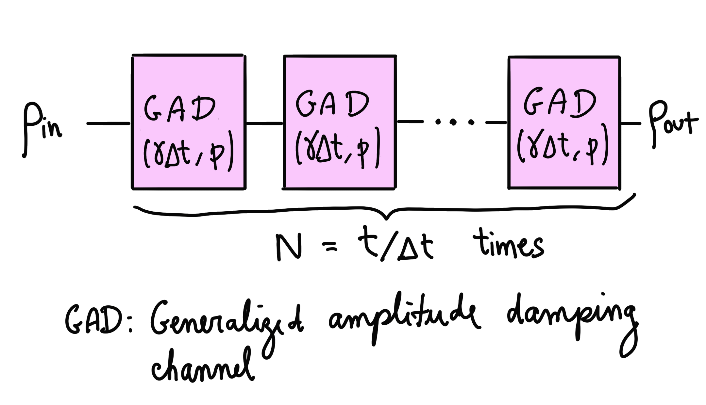

### Backstory

Zenda and Reece discuss strategies to interfere with the correct functioning of Sqynet, the conscious quantum computer that's taking over the galaxy. One way to tamper with its hardware is to bombard Sqynet's outer shell with plasma grenades, exposing the quantum computer to higher temperatures. As a consequence, Sqynet won't be able to prepare its ground state quickly.

### Preparing ground states

Preparing a fiducial state, usually denoted by $\lvert 0 \rangle,$ is the first step before carrying out any quantum computations. For most quantum computers, this is a straightforward process (although sometimes energy and time consuming). We need to bring the quantum device to almost absolute zero so that it relaxes to its *ground state* —the state of minimal energy— which is our choice of fiducial state.

Why does this happen? Quantum systems are never really isolated, so they will exchange energy with their environment. The net effect is that any quantum properties of the system's state, i.e. superpositions and entanglement, are lost after some time. 

How do we model this energy exchange at finite temperature? The *Generalized Amplitude Damping channel* provides a good approximation. Suppose $\gamma$ is the photon loss rate at zero temperature, and $p$ is the probability that a qubit emits a photon to the finite-temperature environment (the system will also absorb photons with probability $1-p$). We can approximate the interaction with the environment for a duration $t$ via the circuit below.

That is, we compose many [Generalized Amplitude Damping channels](https://docs.pennylane.ai/en/stable/code/api/pennylane.GeneralizedAmplitudeDamping.html) with infinitesimal noise parameters $\gamma\Delta t$ and de-excitation probability $p$. A shorter `step` $\Delta t$ gives a more precise calculation, but we will need more Generalized Amplitude Damping channels to model the same duration $T$. 

Zenda and Reece need to figure out a measure of how quickly Sqynet can relax its fiducial state, given some photon loss rate $\gamma$ and emission probability $p$. Assuming that Sqynet is in the initial state 

$$ 
\lvert + \rangle = \frac{1}{\sqrt{2}}\lvert 0\rangle +  \frac{1}{\sqrt{2}}\lvert 1\rangle,
$$

your task is to estimate the *relaxation half-life*, which is the time at which we obtain the outcome $\lvert 1 \rangle$ with probability 1/4 (the measurement is performed in the computational basis).

## Challenge code

You must complete the `half_life` function to calculate the time $T$ at which the probability of measuring $\lvert 1 \rangle$ becomes 1/4.

### Input

As input to this problem, you are given:

- `gamma` (`float`): The zero-temperature photon loss rate.
- `p` (`float`): The de-excitation probability due to temperature effects
 
### Output

This code will output a `float` equal to your estimate of the relaxation half-life. Note that you may require the step and iterations of your circuit to actually reach the half-life.

If your solution matches the correct one within the given tolerance specified in `check` (in this case it's an absolute tolerance of `0.2`), the output will be `"Correct!"` Otherwise, you will receive a `"Wrong answer"` prompt.

Good luck!
