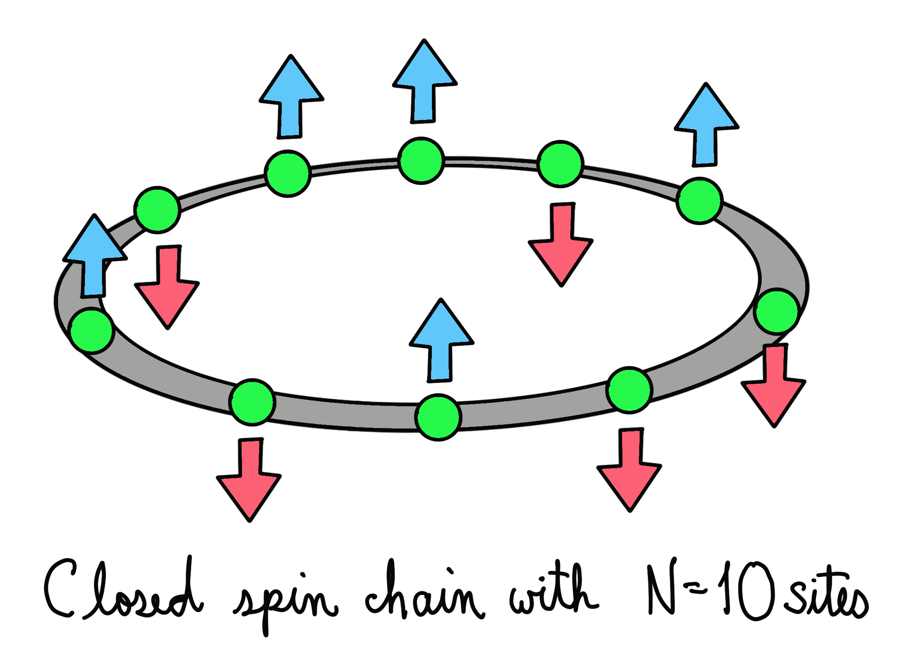

### Backstory

Zenda and Reece model Sqynet as a spin chain, and they come up with a strategy. What if, in addition to using plasma bombs and missiles to increase the temperature of the device, they use a strong magnetic field? After all, magnetic fields might pass through Sqynet's outer shell more easily. The scientists proceed to simulate the effect of a magnetic field on a closed spin chain to quantify the effects. 

### Ground state of an Ising spin chain

A simple way to model Sqynet is by considering it as a closed spin chain of length $N$. A spin chain contains particles of spin $1/2$ in each of its $N$ sites. The spins may be pointing in the positive or negative $z$ direction, and we consider that there may be an external magnetic field acting on the system.  

Such a quantum system is described by the *Transverse Ising Hamiltonian*. For closed spin chain with a transverse magnetic field of intensity $h$, the Transverse Ising Hamiltonian reads

$$
H = -\sum_{i=1}^{N}Z_{i}\otimes Z_{i+1} - h\sum_{i}^{N}X_{i}.
$$

The subindices $i$ indicate the spin site  where the operators act. In a closed spin chain, we identify site $N+1$ with the first site. 

A possible plan for Zenda and Reece is to use a strong magnetic field that changes the ground energy of Sqynet, causing it to malfunction. 

Your task is to help Zenda and Reece calculate the effect of external magnetic forces on the ground energy. Using the Variational Quantum Eigensolver (VQE) algorithm, you will compute the ground energy of a closed spin chain of length $N=4$. 

<b>Epilogue</b>

Zenda and Reece fire their powerful magnetic field, missiles, and bombs into the tangle of spins that is Sqynet. As its wavefunction starts to collapse, reality around them shimmers and shifts, and they are enveloped in the purple smoke characteristic of the Oracle World Transform.

The smoke clears. The Bloch clock is ticking; they are late for their weekly brainstorming session at Trine's Designs. Trine is fussing excitedly with the new coffee machine. The network is patchy. Zenda and Reece smile at each other. There are far worse things, they realize, than business as usual.

## Challenge code

In this challenge you will be given the following functions: 
- `create_Hamiltonian`: In which you build the Transverse Ising Hamiltonian for $N=4$ and a magnetic field intensity `h`. **You must complete this function.**
- `model`: This QNode builds a general enough ansatz for the ground state. This circuit must depend on some parameters `params`, which you will later optimize. It returns the expectation value of the Hamiltonian for the output state of the circuit. **You must complete this function.**
- `train`: This function returns the parameters that minimize the output of `model`. **You must complete this function.**

### Input

As input to this problem, you are given:

- `h` (`float`): Magnetic field intensity applied to the spin chain.
 
### Output

This code will output a `float` corresponding to the energy of the ground state.

If your solution matches the correct one within the given tolerance specified in `check` (in this case it's an relative tolerance of `0.1`), the output will be `"Correct!"` Otherwise, you will receive a `"Wrong answer"` prompt.

Good luck!
