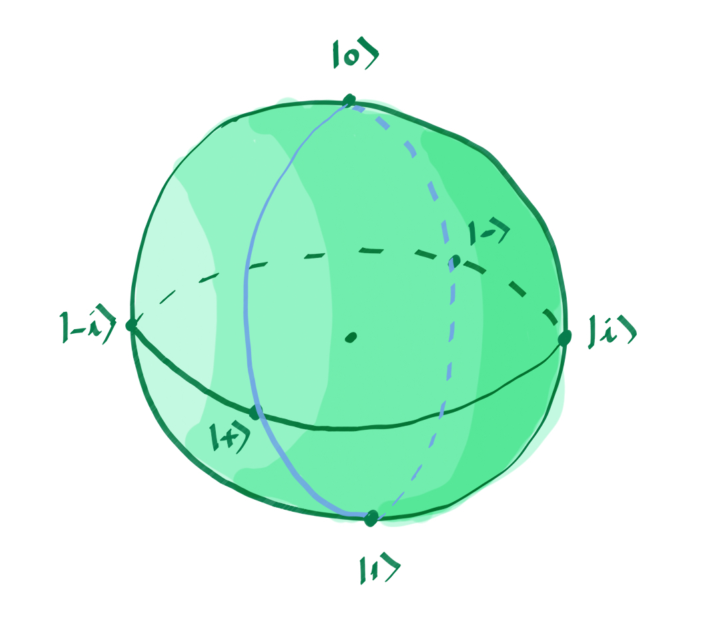
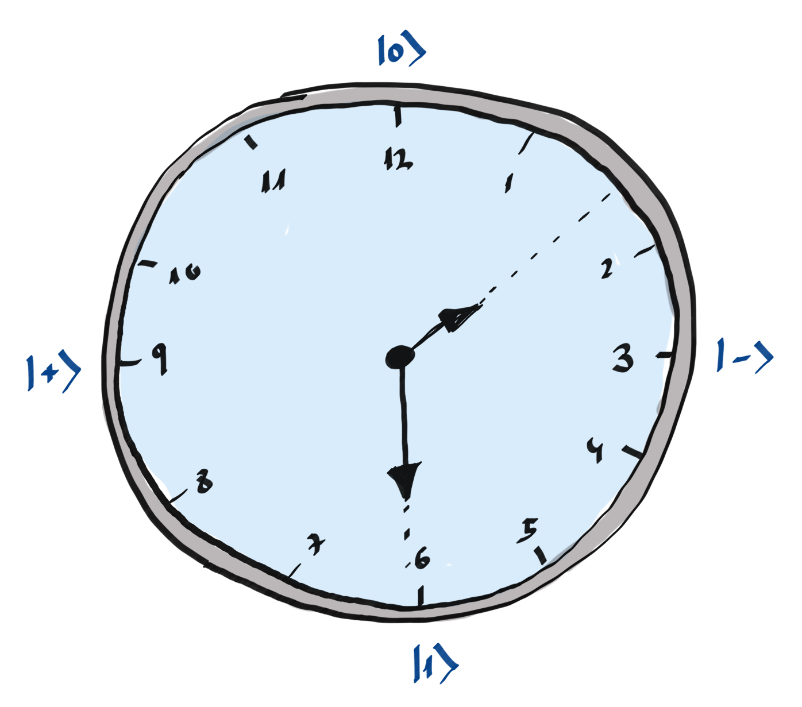

### Backstory

Zenda and Reece work at a firm, Trine's Designs, that uses quantum devices for very silly things. Their job as physicists is fun, since they get to program and fix quantum devices of all sorts, such as clocks, coffee machines, and lazy-worker detectors. The office has purchased a new quantum clock. To tell time, one has to read quantum states. They'd better get used to it, or they'll be late for their meetings!

### The clock and the Bloch circumference

The Bloch sphere is the most widespread representation of a qubit. However, if we only consider states whose amplitudes are real, you could represent what we will call *the Bloch circumference*.

In the figure above, we are representing the state $|+\rangle$ on our circle, since the arrow points in this direction. This circumference is completely equivalent to the blue one, shown below inside the Bloch sphere.

In Zenda and Reece's office, the new way to tell the time is to read two states in Bloch's circumference. The state $|0\rangle$ corresponds to 12h on a clock, $|1\rangle$ would be equivalent to 6h, $|+\rangle$ would be 9h, and so on. In this challenge we are going to work with 2 qubits. The first one corresponds to the hour hand and the second one to the minutes. You will be given the time of the day as the input and you will have to generate the quantum states equivalent to such time.

Here's an example of a clock striking 1:30. The qubit on the first wire of your circuit will be the small hand, and the qubit on the second wire, the big hand.

## Challenge code

You must complete the `time` function that will take the hour and minutes as an argument and generate the two-qubit state associated to the indicated time.

### Input

The input will be two integers. The one corresponding to the hours will take values from 1 to 12 and the one corresponding to the minutes will range from 0 to 59.

### Output

The output will be the vector of probabilities of the two-qubit state, measured in the computational basis. You are only asked to complete the gates, we'll handle the rest. Good luck!
