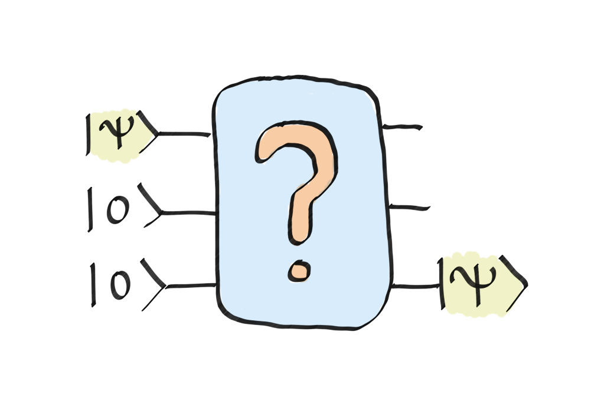
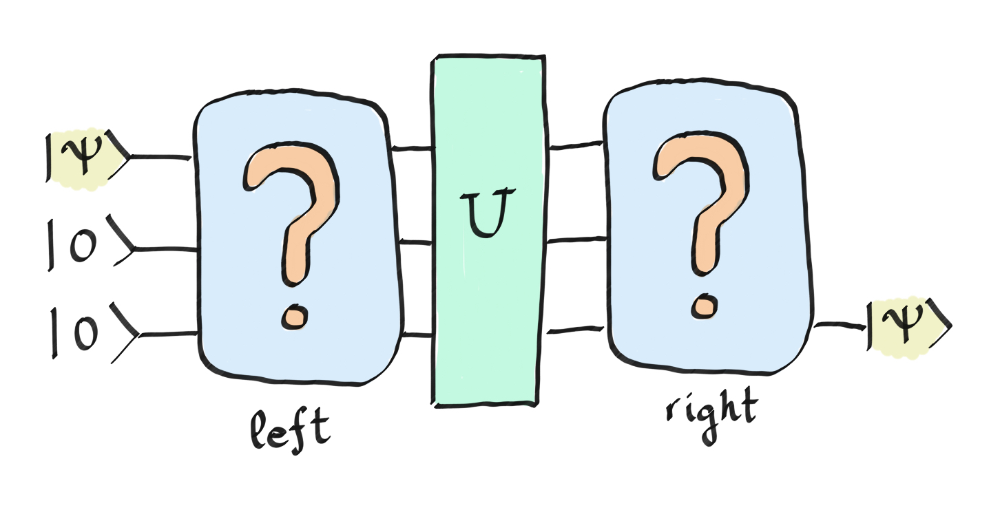

### Backstory

Zenda needs to send an email to Reece through Trine's Designs' Quantum Area Network. The network is a quantum circuit that simply swaps qubits between wires. However, a virus seems to be interfering with proper communication within the network. Zenda can't get rid of the virus, but she has figured out what it's doing. Let's help her reprogram the network to get around the issue. 

### More than just a SWAP

This challenge's statement is very simple, but solving it may not be so easy. The goal will be to move a state $\vert\psi\rangle$ from one qubit to another, as shown in the figure:

Easy, isn't it? Well, we are going to complicate it a little bit. We will not allow any direct connections between the first and last qubits, so you will have to use the middle qubit to pass the information from one qubit to another.

The exercise has become more challenging, but we still want to complicate it further! In addition to all of the above, we are going to generate a virus operator $U$ and place it in the middle of the circuit, like so:

In this case, $U$ consists of one `PauliX` gate that we place randomly in one of the three qubits (each time, the gate is generated in a different wire).
You should be able to complete the circuit so that, regardless of the randomly generated operator $U$, you are able to move the state from the first qubit to the last qubit.

## Challenge code

In this challenge, you will only be asked to complete the `circuit_left` and `circuit_right` operators to meet the objective of the statement.

### Input

To encode the initial state $\vert \psi \rangle,$ we will use a $U3$ gate. The input will be the three parameters (`alpha`,`beta`,`gamma`) associated with this gate.

### Output

In this case, the output is the measurement result of the last qubit with respect to an observable. In this way, we check if it coincides with the expected state. Good luck!
