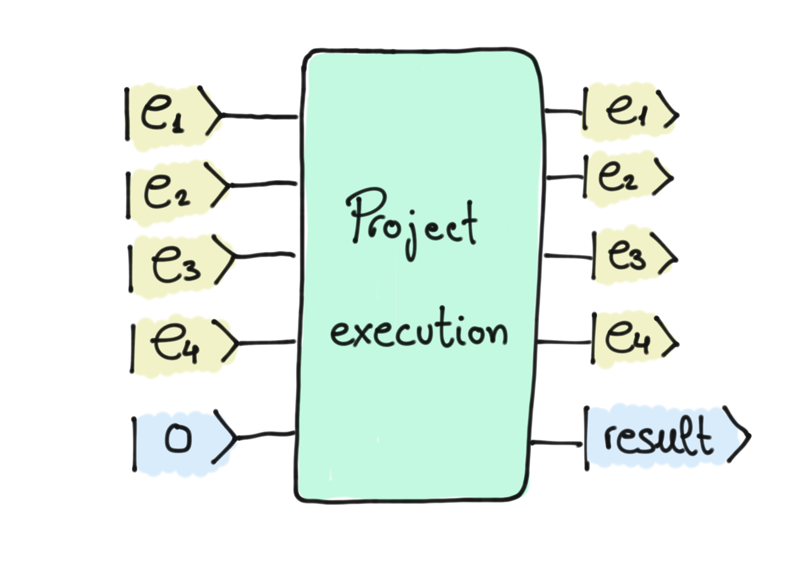

### Backstory

It is very common to work in teams, but it is just as common to find a teammate who decides not to work. However, colleagues do not usually tell the boss, so this individual goes unnoticed. Zenda is supervising four employees, and it is known that one of them never works. But who is it? 

### Finding the lazy employee

The project Zenda's team is working on can only be completed if **at least three people** in the team are working. Let's model this situation in a circuit:

In this diagram, the qubit $e_i$ refers to the $i$-th employee, which will take the value 1 if this employee is chosen to work on the project.  The output state labelled *result* will take the value 0 if the project was not completed and 1 if it was. Let us imagine that employee $e_1$ is the one who does not work. Then, if we apply the operator to the state $|1\rangle|1\rangle|0\rangle|1\rangle|0\rangle$ (that is, we select $e_1$, $e_2$ and $e_4$ for the project), the output will be $|1\rangle|1\rangle|0\rangle|1\rangle|0\rangle$. As we can see, the last qubit is still $\lvert 0\rangle$, i.e. the project has not been carried out. This is because there are only two employees that actually work on the project, and a minimum of three is required.

Zenda wants to know who the lazy worker is, executing as few projects as possible. For this reason, they ask you to help her with your quantum skills. You are asked to discover who the lazy employee is, using a single shot and a single call to the "Project execution" operator.

## Challenge code

On one hand, you are asked to complete `circuit` (you only need to apply gates). You can only call the `project_execution` operator once, which is already incorporated in the template. 
On the other hand, you must complete `process_output`, which will take the output of your circuit and will return who the lazy guy is.

The `project_execution` function will be generated when testing the solution; if you want to experiment with the function output in the notebook, you can temporarily replace `project_execution` with an operator of the form `qml.MultiControlledX(wires=['e1', 'e2', 'e4', 'result'])`. In this case, the absence of "e3" on the wires means that in this project, "e3" will be the lazy employee. Just remember to switch it back to project_execution before submitting, so that your function uses the correct project_execution during testing!

You may find it useful to do some tests in [Quirk](https://algassert.com/quirk) before you start coding.

### Output

To judge this challenge, we will arbitrarily generate 5000 different projects (`project_execution`), which we will send one by one to the circuit to check that your prediction is correct ("e1", "e2", "e3" or "e4"). Therefore, in this case, there will be no public and private test cases. Good luck!
