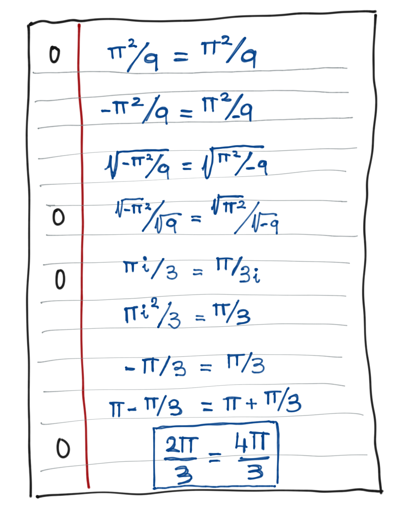

### Backstory

Trine's Designs is very community-oriented, and customers like to write letters to the staff to get help with a variety of issues. A mysterious person has sent a non-sensical mathematical proof about complex numbers. No one at the company is good at complex analysis, but Zenda and Reece set out to use a quantum circuit to prove the anonymous customer wrong.

### One-shot proof

In the 17th century, a nice custom spread among intellectuals: challenging each other to solve numerical problems and puzzles. These challenges were sent through letters and, thanks to this, mathematics expanded and gained a lot of popularity.

It seems that this tradition is making a comeback because the other day Reece received the following letter at the office:

"Hello Trine team, I have just come to a discovery of great importance, I have just proved that $\frac{2\pi}{3}=\frac{4\pi}{3}.$ I attach a simple proof. If you think I'm wrong, prove it!*"

Actually, the proof is very convincing, but Reece turns to quantum computing to show that this is not so (for fun, if you like math: find the line where the mistake is!). To do this, Reece manages to show that $R_Y(\frac{2\pi}{3})$ is different from $R_Y(\frac{4\pi}{3}).$ In fact, they are so different that a single shot is enough to distinguish them!

This will be your objetive for this challenge! We are going to give you a gate $U$, which you know is either $R_Y(\frac{2\pi}{3})$ or $R_Y(\frac{4\pi}{3}).$ Your task will be to build a quantum circuit containing $U$ to unambiguously determine which of the two gates it is using only *one shot*.  

To do this, you will have access to a two-qubit circuit. You can use $U$ as many times as you want, but one thing is important: the solution must guarantee with **100% probability** which of the two options it is.

<i>Note:</i> even if you do not know $U$, you are allowed to use `qml.ctrl` over $U$ if necessary.

<b>Epilogue</b>

After successfully debunking the proof, Zenda and Reece are enjoying a well-deserved rest from office hijinks when Doc Trine, the boss herself, appears from the basement laboratory. "Well, it seems you have passed my little math test! Please, step into my office." Her office is the basement, and they filled with all sorts of odds and ends: a machine whose only function is to turn itself off, an anti-toaster for making old bread fresh, some sort of tiny imp lugging around two chambers and looking for work. Trine looks at them: "I think you might be excited by my latest invention. It promises to save us all a lot of time!"

<i>Read on in <b>Bending Bennett's Laws</b>.</i>

## Challenge code

On one hand you are asked to complete `circuit` (you only need to apply gates).
On the other hand you must complete `process_output`, which will take the output of `circuit` (a vector of dimension two where each term can take the value 0 or 1) and will return 2 if $U = RY(2\pi/3)$ or 4 if $U = RY(4\pi/3).$

### Output

The circuit function will receive the gate $U$ that you are asked to determine. To judge whether your circuit works as expected, we will randomly send 5000 different examples and check that they always classified correctly. Therefore, in this question there are no public or private test cases. They are randomly generated.
Good luck!
