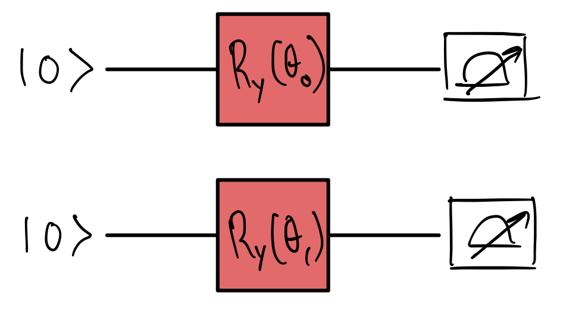

Welcome to the QHack 2023 tutorial challenges! These challenges are worth no points — they are specifically designed to get your brain active and into the right mindset for the competition. You will also learn about various aspects of PennyLane that are essential to quantum computing, quantum machine learning, and quantum chemistry. Have fun!

### Tutorial \#2 — Building a quantum circuit

In PennyLane, the fundamental unit of quantum circuit simulation is called a *QNode*. Basically, a QNode takes a *quantum function* — a Python function that contains instructions in the form of quantum gates acting on wires — and a device, runs the function on the device, and returns a measurement. To see how this works, check out our [YouTube video](https://youtu.be/2T8lSejPFog).

In this challenge, you need to simulate the following quantum circuit and return the resulting probability distribution as an output.

## Challenge code

In the notebook `affairs_of_state.ipynb`, you are given a function called `circuit`. **You must complete this function** by specifying a device, turning `circuit` into a QNode, and providing the appropriate gates. 

Here are some helpful resources:

- [Creating a quantum circuit — YouTube video](https://youtu.be/2T8lSejPFog)
- [Basic tutorial: qubit rotation](https://pennylane.ai/qml/demos/tutorial_qubit_rotation.html)
- [Quantum circuits in PennyLane](https://docs.pennylane.ai/en/stable/introduction/circuits.html#quantum-functions)

### Input 

As input to this problem, you are given two `angles` (`list(float)`). The first and second entries of `angles` correspond to $\theta_0$ and $\theta_1$ in the diagram above.

### Output

This code must output the probabilities (`numpy.tensor`) resulting from the quantum circuit pictured above. 

If your solution matches the correct one within the given tolerance specified in `check` (in this case it's a `1e-4` relative error tolerance), the output will be `"Correct!"` Otherwise, you will receive a `"Wrong answer"` prompt.

Good luck!
