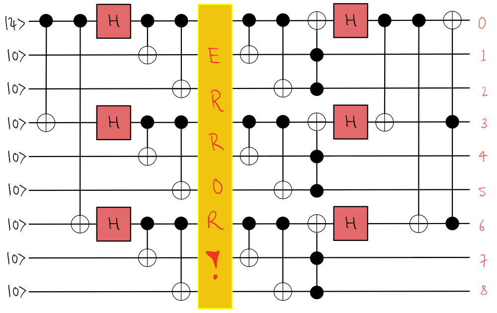

Welcome to the QHack 2023 tutorial challenges! These challenges are worth no points — they are specifically designed to get your brain active and into the right mindset for the competition. You will also learn about various aspects of PennyLane that are essential to quantum computing, quantum machine learning, and quantum chemistry. Have fun!

### Tutorial \#3 — Shor's 9-qubit-code

Quantum computational advantage — the ability of quantum computers to perform certain tasks faster than the best classical computers — has now been demonstrated in a number of cases.
Arguably, the next big milestone in quantum computing is *fault-tolerance* for large-scale devices, allowing them to correct errors that crop up as a result of noisy interactions with the environment or between parts of the computer.

The early years of quantum error correction yielded several ground-breaking protocols, none more famous than Peter Shor's 9-qubit-code, pictured below.

In this challenge, you will implement Shor's code for an arbitrary initial state $\vert \psi \rangle$ that is subject to an error. 

## Challenge code

In the notebook `a_shor_thing.ipynb`, you are given a couple functions:

- `shor`: a QNode that contains the operations required to define Shor's code given an initial `state` and an `error` occuring in the middle of the circuit. It must output the expectation value of the Pauli Z operator on each qubit. **You must complete this function**.
- `error`: this function contains the error operator that will be introduced into the circuit you create with `shor`. The possible errors are Pauli X, Y, and Z errors (see `error_dict`). To call this within `shor`, simply write `error(error_key, qubit)` and it will apply the error!

Here are some helpful resources:

- [Shor code](https://en.wikipedia.org/wiki/Quantum_error_correction#Shor_code)
- [Quantum error correction](https://en.wikipedia.org/wiki/Quantum_error_correction)

### Input 

As input to this problem, you are given:

- `state` (`list(float)`): defines the initial one-qubit state $\vert \psi \rangle$. The remaining 8 qubits are initialized in the $\vert 0 \rangle$ state.
- `error_key` (`int`): an integer corresponding to a Pauli X, Y, or Z error. See `error_dict`.
- `qubit` (`int`): an integer corresponding to which qubit the error will occur on.

### Output

This code must output a `list(float)` corresponding to the expectation values of the Pauli Z operator on every qubit.

If your solution matches the correct one within the given tolerance specified in `check` (in this case it's a `1e-4` relative error tolerance), the output will be `"Correct!"` Otherwise, you will receive a `"Wrong answer"` prompt.

Good luck!
