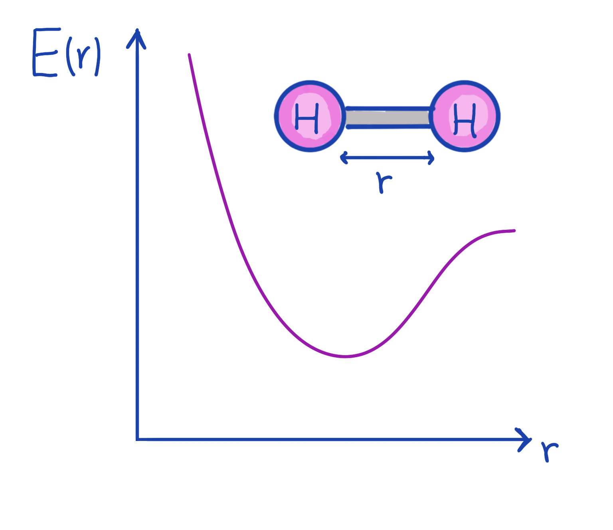

Welcome to the QHack 2023 tutorial challenges! These challenges are worth no points — they are specifically designed to get your brain active and into the right mindset for the competition. You will also learn about various aspects of PennyLane that are essential to quantum computing, quantum machine learning, and quantum chemistry. Have fun!

### Tutorial \#5 — Hi, Hydrogen! 

The Variational Quantum Eigensolver (VQE) algorithm has been touted as a game-changing near-term quantum algorithm. 
In particular, VQE is able to efficiently simulate low-energy properties of small molecules. 
In this challenge, you will calculate the energy of the hydrogen molecule for various molecular charges and bond length combinations.

## Challenge code

In the notebook `hi_hydrogen.ipynb`, you are given a few functions:

- `hydrogen_hamiltonian`: This function will return the qubit Hamiltonian of the hydrogen molecule given the `coordinates` of both hydrogen atoms and the net molecular `charge`. You'll usually find hydrogen molecules with a charge of 0, but here we'll spice it up with a non-zero charge!
- `num_electrons`: In subsequent functions, we'll need the total number of electrons in the hydrogen molecule we're looking at. With a charge of 0, the hydrogen molecule usually has just 2 electrons, one per hydrogen atom. Given the `charge`, how many electrons should it have? ***You must complete this function.***
- `hf`: The "HF" stands for Hartree–Fock. This function's purpose is calculate the HF approximation — treat every electron as independent, electrons move under a Coulomb potential from the positively charged nuclei, and there's a mean field from the other electrons — for the ground state of the hydrogen molecule we're interested in. We'll use this later, so ***you must complete this function.***
- `run_VQE`: This function takes the `coordinates`, `charge`, generates the HF state, defines a `cost` function and minimizes it. ***You must complete this function*** by:
  + defining the gates within the `cost` function, using the [`qml.AllSinglesDoubles`](https://docs.pennylane.ai/en/stable/code/api/pennylane.AllSinglesDoubles.html) template with `singles` and `doubles` arguments defined below; and
  + returning what we want to minimize, namely the expectation value of the hydrogen Hamiltonian! 

Here are some helpful resources:

- [Building molecular Hamiltonians](https://pennylane.ai/qml/demos/tutorial_quantum_chemistry.html)
- [A brief overview of VQE](https://pennylane.ai/qml/demos/tutorial_vqe.html)
- [Variational Quantum Eigensolver](https://youtu.be/4Xnxa6tzPeA)
- [Quantum Chemistry documentation](https://docs.pennylane.ai/en/stable/introduction/chemistry.html)

### Input 

As input to this problem, you are given:

- `coordinates` (`list(float)`): the $x$, $y$, and $z$ coordinates of each hydrogen atom
- `charge` (`int`): the charge of the hydrogen molecule. It could be positive, negative, or zero!

### Output

This code must output the ground state `energy` (`float`) of the hydrogen molecule in question.

If your solution matches the correct one within the given tolerance specified in `check` (in this case it's a `1e-3` relative error tolerance), the output will be `"Correct!"` Otherwise, you will receive a `"Wrong answer"` prompt.

Good luck!
