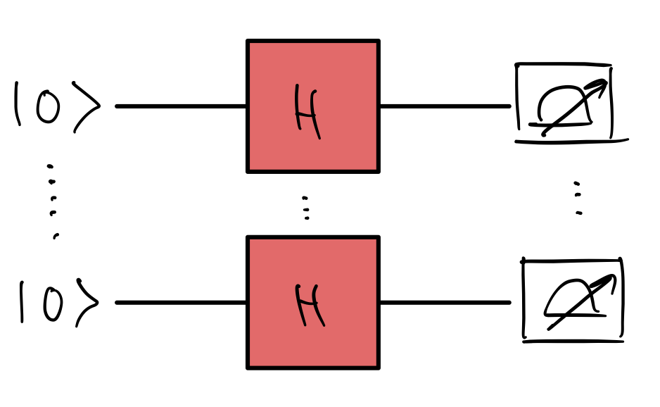

Welcome to the QHack 2023 tutorial challenges! These challenges are worth no points — they are specifically designed to get your brain active and into the right mindset for the competition. You will also learn about various aspects of PennyLane that are essential to quantum computing, quantum machine learning, and quantum chemistry. Have fun!

### Tutorial \#6 — Hamiltonians 

The Hamiltonian is the energy observable for a quantum system, and a
quintessential component in many quantum algorithms. How do we implement Hamiltonians in PennyLane? You'll be tested on this in this challenge.

You will be tasked with creating the Hamiltonian

$$
H = \frac{1}{3} \sum_{i < j} X_i X_j - \sum_{i = 0}^{n-1} Z_i,
$$

where $n$ is the number of qubits, $X_i$ and $Z_i$ are the familiar Pauli X and Z operators, respectively, and $\sum_{i < j}$ denotes a sum over all pairs (e.g. for $n = 3$, the pairs are (i, j) = (0, 1), (0, 2), (1, 2)). Note that we're indexing from 0!

In this challenge, you need to create the following quantum circuit simulation that returns the expectation value of this Hamiltonian.

To be clear, each wire represents $n$ qubits, and $\vert 0\rangle$
really means $\vert 0\rangle^{\otimes n}$, i.e. the $\vert 0\rangle$
state for each of these $n$ qubits. Also, be mindful that the $H$ gates 
represent the Hadamard gate, not the Hamiltonian (which is not unitary,
in general)!

## Challenge code

In the notebook `hamiltonian_sandwich.ipynb`, you must complete two functions:

- `hamiltonian`: responsible for creating the Hamiltonian in question for a general number of qubits (`num_wires`). **You must complete this function**.
- `expectation_value`: simulates the circuit in question and returns the expectation value of the Hamiltonian in question. **You must complete this function** by creating a QNode within this function that returns the expectation value of the Hamiltonian. 

Here are some helpful resources and hints:

- The $X_i X_j$ term, mathematically, denotes a *tensor product* between the two Pauli-X operators. Here are some ways you can perform this in PennyLane:
  + use the `@` operator to take the tensor product between operators;
  + use [`qml.prod`](https://docs.pennylane.ai/en/stable/code/api/pennylane.prod.html).
- [`qml.Hamiltonian`](https://docs.pennylane.ai/en/stable/code/api/pennylane.Hamiltonian.html)
- [Operator arithmetic](https://pennylane.ai/blog/2022/08/pennylane-v025-released/#intuitive-operator-arithmetic)

### Input 

As input to this problem, you are given the number of qubits $n$, `num_wires` (`int`).

### Output

This code must output the expectation value of the Hamiltonian (`float`).

If your solution matches the correct one within the given tolerance specified in `check` (in this case it's a `1e-4` relative error tolerance), the output will be `"Correct!"` Otherwise, you will receive a `"Wrong answer"` prompt.

Good luck!
