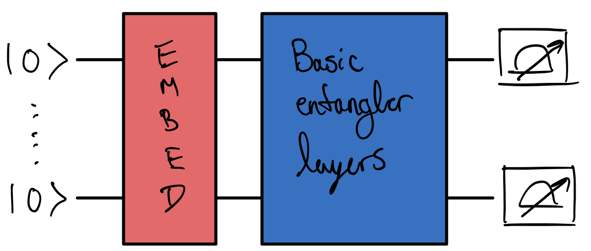

Welcome to the QHack 2023 tutorial challenges! These challenges are worth no points — they are specifically designed to get your brain active and into the right mindset for the competition. You will also learn about various aspects of PennyLane that are essential to quantum computing, quantum machine learning, and quantum chemistry. Have fun!

### Tutorial \#7 — Quantum machine learning

Quantum machine learning is an area of research that explores the interplay between quantum computing and machine learning. Quantum machine learning models might offer significant speedups for performing certain tasks like classification, image processing, and regression. 

In this challenge, you'll learn the meat and potatoes of training a quantum machine learning model. Specifically, you will implement a procedure for embedding classical numbers into a quantum computer, construct a simple quantum machine learning model, and perform three optimization steps. The quantum circuit in the model that you will implement looks like this:

## Challenge code

In the notebook `optimize_this.ipynb`, you must complete the following functions:

- `three_optimization_steps`: performs three optimization steps. **You must complete this function**.
- `cost`: this is within the `three_optimization_steps` function. **You must complete this function**. `cost` is a QNode that does a few things:
  + acts on 3 qubits only;
  + embeds the input `data` via [amplitude embedding](https://docs.pennylane.ai/en/stable/code/api/pennylane.AmplitudeEmbedding.html);
  + defines some differentiable gates via a template called [qml.BasicEntanglerLayers](https://docs.pennylane.ai/en/stable/code/api/pennylane.BasicEntanglerLayers.html); and
  + returns the expectation value of the sum of the Pauli Z operator on all $n$ qubits:

$$
\sum_{i = 1}^n Z_i.
$$

Within the `three_optimization_steps` function is a variable called `weights`. These are the changeable parameters that help define the `qml.BasicEntanglerLayers` template that you must put in the `cost` function. `weights` are the parameters that will be optimized (and need to be referred to by this name due to the final call `return cost(weights, data=data)`, which cannot be edited).

To perform three optimization steps, use a gradient decent optimizer — `qml.GradientDescentOptimizer` — with a step size of $0.01$.

Here are some helpful resources:

- [Optimizing a quantum circuit — YouTube video](https://youtu.be/TiQ7T1h8VAQ)
- [Basic tutorial: qubit rotation — Optimization](https://pennylane.ai/qml/demos/tutorial_qubit_rotation.html#optimization)

### Input 

As input to this problem, you are given classical `data` (`list(float)`) that you must embed into a quantum circuit via [amplitude embedding](https://docs.pennylane.ai/en/stable/code/api/pennylane.AmplitudeEmbedding.html).

### Output

This code must output the evaluation of `cost` after three optimization steps have been performed.

If your solution matches the correct one within the given tolerance specified in `check` (in this case it's a `1e-4` relative error tolerance), the output will be `"Correct!"` Otherwise, you will receive a `"Wrong answer"` prompt.

Good luck!
