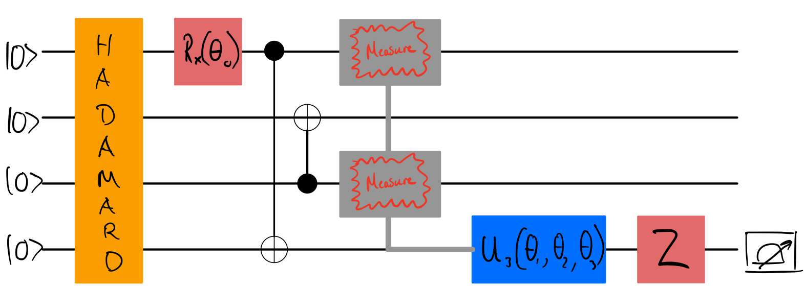

Welcome to the QHack 2023 tutorial challenges! These challenges are worth no points — they are specifically designed to get your brain active and into the right mindset for the competition. You will also learn about various aspects of PennyLane that are essential to quantum computing, quantum machine learning, and quantum chemistry. Have fun!

### Tutorial \#8 — Mid-circuit measurements

In classical computations, inserting control flow — e.g, `if` statements — right 
in the middle of a large computation is no problem at all since measuring variables
does not affect the output of the computation. The same can't be said about quantum
computations — if we measure, we better be careful!

In this challenge, you'll look at how mid-circuit measurements work in PennyLane.

## Challenge code

In the notebook `stuck_in_the_middle_with_u.ipynb`, you are given a function called `circuit`. **You must complete 
this function** by constructing the following four-qubit circuit:

The circuit has a Hadamard gate on every qubit, an $R_x$ gate, a couple of 
CNOTs, and then the mid-circuit measurements. Note here that the measurements happen 
on the first and third qubits, and that the [`qml.U3`](https://docs.pennylane.ai/en/stable/code/api/pennylane.U3.html) gate is only applied to the 
fourth qubit if the following condition is met upon measuring the first and third 
wires: $m_0 + m_2 \geq 1$ (i.e. at least one of them is $1$). The last operator, `qml.PauliZ` on the fourth qubit, is 
applied regardless.

The [`qml.measure`](https://docs.pennylane.ai/en/stable/code/api/pennylane.measure.html) 
function should be helpful to you!

### Input 

As input to this problem, you are given:

- `angles` (`list(float)`): a list of angles containing $\theta_0$, $\theta_1$, $\theta_2$, and $\theta_3$ in that order. Use this to create the circuit!

### Output

This code must output a `numpy.tensor` containing  the probabilities associated to a computational basis measurement **on the fourth qubit.**

If your solution matches the correct one within the given tolerance specified in `check` (in this case it's a `1e-4` relative error tolerance), the output will be `"Correct!"` Otherwise, you will receive a `"Wrong answer"` prompt.

Good luck!
